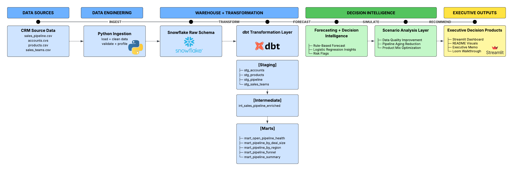
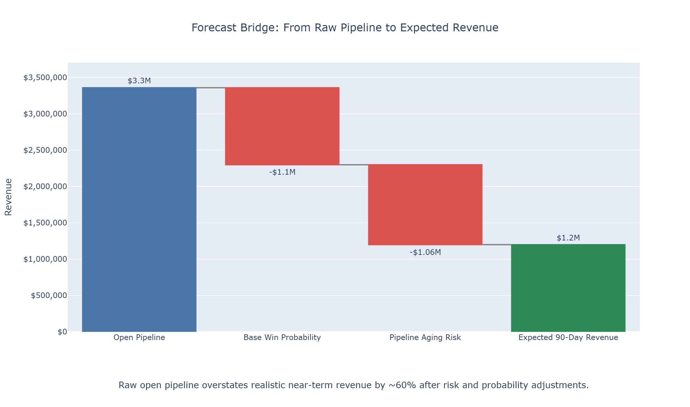
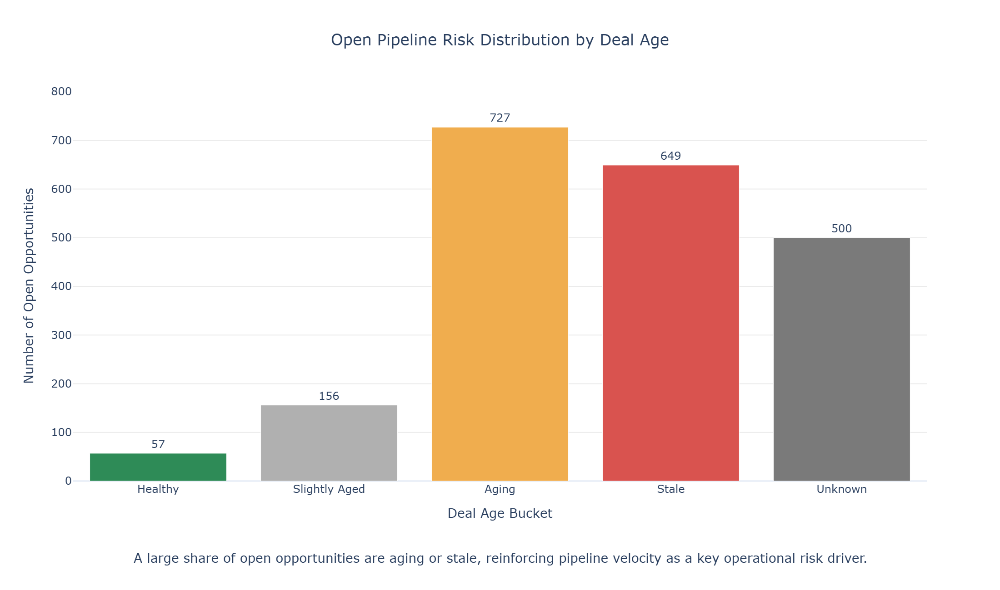
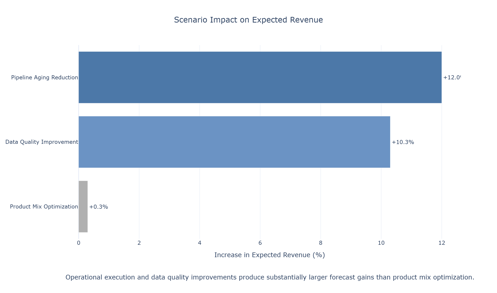
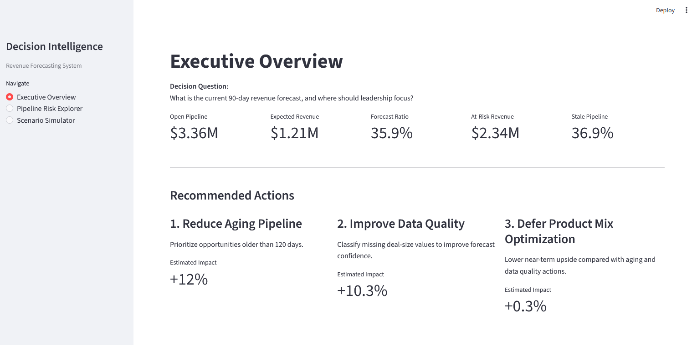
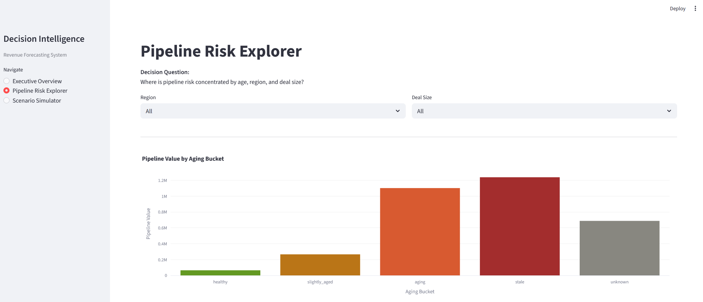
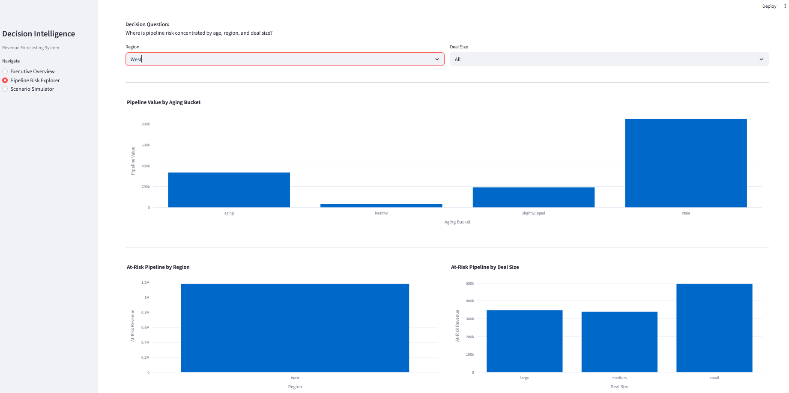
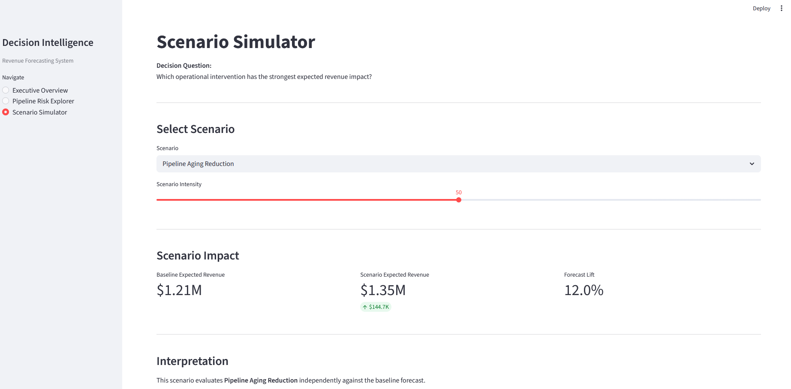

# Decision Intelligence System for Revenue Forecasting

## Live Demonstration

🎥 Loom Walkthrough: [Watch the Project Demo](https://www.loom.com/share/c1146d460c5b4e46abc3818c06a9f0e7)
🚀 Streamlit Application: [Launch App](https://pipeline-decision-intelligence-vdsjg45bappnchzmh86shyb.streamlit.app/)

## Executive Summary

This project simulates a decision intelligence system designed to improve revenue forecasting and pipeline visibility using CRM opportunity data.

Rather than focusing only on predictive modeling, the project evaluates the operational drivers of pipeline performance and provides actionable recommendations to improve forecast reliability.

## Business Problem

Revenue forecasting is critical for sales and finance leadership, but pipeline data is often incomplete, inconsistent, and difficult to interpret. 

Leaders need to understand not just expected revenue, but:
- where the pipeline is strong or weak
- which deals are at risk
- what actions can improve outcomes

Traditional reporting surfaces metrics, but does not support decision-making.

## Project Objectives

Build an end-to-end decision intelligence system that:
- transforms raw CRM pipeline data into analysis-ready datasets
- generates a 90-day expected revenue forecast
- identifies pipeline risks and performance drivers
- evaluates business scenarios to support decision-making 

## Key Outcomes

- Built a 90-day expected revenue forecasting model
- Identified pipeline aging and data quality as primary risk drivers
- Developed scenario analysis to simulate business interventions
- Quantified impact of key actions:
  - Pipeline aging reduction: **+12% expected revenue**
  - Data quality improvement: **+10.3% expected revenue**
  - Product mix optimization: **+0.3% expected revenue**

## End-to-End Decision Intelligence Workflow

1. Data ingestion and cleaning (Python)
2. Data validation and profiling
3. Warehouse modeling (Snowflake + dbt)
4. Analytical marts for pipeline performance
5. Revenue forecasting model (rule-based)
6. ML model for diagnostic insights (logistic regression)
7. Scenario analysis for decision support

## Decision Intelligence System Architecture
This architecture illustrates the end-to-end flow from raw CRM opportunity data through warehouse transformation, forecasting logic, scenario simulation, and executive decision-support outputs.

## Tech Stack

- Python (pandas, scikit-learn, plotly)
- SQL (Snowflake)
- Snowflake (warehouse)
- dbt (data modeling)
- Git / GitHub 
- Streamlit

## Data Architecture & Models

Data is structured using a layered dbt approach:

- **Staging:** cleaned source data  
- **Intermediate:** enriched opportunity-level model  
- **Marts:** decision-ready analytics and KPIs  

Key models include:
- `int_sales_pipeline_enriched` — opportunity dataset  
- `mart_pipeline_summary` — executive KPI layer  
- `fct_pipeline_forecast` — deal-level expected revenue 

## Forecast Design

The model estimates probability-weighted expected revenue over a 90-day horizon.

**Core formula:**

> Expected Revenue = Estimated Deal Value × Adjusted Close Probability  
> Adjusted Close Probability = Base Win Rate × Age Multiplier

- Base win rate is segmented by deal size  
- Age multiplier adjusts probability based on deal aging  

**Deal Sizes:**
- Small: < 5,000
- Medium: < 20,000 
- Large: > 20,000  
- Unknown: missing close value amount 

**Deal age buckets:**
- Healthy: ≤ 60 days  
- Slightly Aged: 61–120 days  
- Aging: 121–200 days  
- Stale: > 200 days  
- Unknown: missing age  

**Age multipliers:**
- Healthy: 1.0  
- Slightly Aged: 0.85  
- Aging: 0.65  
- Stale: 0.35  
- Unknown: 0.5  

## Revenue Forecast Bridge

The chart below illustrates how raw open pipeline value is reduced through baseline win probability and pipeline aging adjustments to arrive at realistic expected 90-day revenue.

Key observations:
- Raw open pipeline value (~$3.3M) significantly overstates realistic near-term revenue expectations.
- Baseline win probability and pipeline aging reduce expected 90-day revenue to approximately $1.2M.
- Pipeline aging represents a major source of forecast degradation and operational risk.

## Forecast Findings

The model reveals a significant gap between headline pipeline value and realistic near-term revenue.

- Open pipeline totals **~$3.3M**, but expected 90-day revenue is only **~$1.2M**, reflecting a ~60% reduction after adjusting for deal age and quality.
- Approximately **90% of open opportunities are at risk**, driven by aging, stalled progression, or missing data.
- Pipeline risk is heavily concentrated in **aging, stale, and unknown opportunities**, which account for most forecast uncertainty.
- **Medium deals are the most efficient**, while **large deals are least predictable**, supporting segmented forecasting.
- Regional differences highlight concentrated risk:
  - **West:** large pipeline, low efficiency
  - **Central:** high forecast ratio but low confidence
  - **East:** more balanced profile

Overall, raw pipeline value significantly overstates expected revenue without accounting for deal condition and data quality.

These findings are derived from the forecasting approach described in the [Forecast Design](#forecast-design) section.

## Pipeline Risk Distribution

The distribution below highlights the concentration of aging and stale opportunities within the open pipeline. These aging segments represent the largest source of forecast degradation and operational risk.

Key observations:
- A substantial portion of the open pipeline falls into aging or stale categories.
- Aging opportunities contribute disproportionately to forecast uncertainty and reduced close probability.
- Pipeline velocity and earlier intervention represent the highest-leverage operational improvements.

## ML Findings (Lightweight Enhancement)

A logistic regression model was trained on historical closed opportunities using deal size, region, product, and deal age.

- ROC AUC: **0.729**, indicating meaningful predictive signal
- Most valuable as a **probability-ranking tool**

Key findings:
- **Unknown deal size** is strongly negative, reinforcing data quality importance
- **Deal size** supports segmented forecasting assumptions
- **Product mix** influences close outcomes
- **Region** has smaller impact on baseline probability
- **Deal age behaves differently** in historical vs open pipeline contexts

## Scenario Analysis

To move from forecasting to decision support, I simulated three realistic business scenarios to evaluate how different operational and strategic levers impact expected 90-day revenue.

Each scenario modifies a targeted subset of the open pipeline and measures the resulting change in expected revenue.

## Scenario 1 — Pipeline Data Quality Improvement

**What was tested:**  
Improving pipeline completeness by reclassifying 50% of unknown-size opportunities with missing or incomplete value fields into realistic size bands (80% small, 20% medium), and imputing segment-based deal values.

**Result:**
- **+$124K expected revenue**
- **+10.3% increase**
- **166 opportunities affected**

**Interpretation:**  
Improving pipeline data quality reveals hidden forecast value and materially improves the usefulness of the forecast. Incomplete deal classification can mask meaningful revenue potential.

## Scenario 2 — Pipeline Velocity Improvement (Aging)

**What was tested:**  
Simulating earlier intervention on 50% of aging and stale opportunities (`deal_age_days > 120`) by reducing effective deal age by 30%.

**Result:**
- **+$140K expected revenue**
- **+12% increase**
- **688 opportunities affected**

**Interpretation:**  
Pipeline aging is a high-leverage operational driver. Proactive management of stalled opportunities can significantly improve near-term revenue outcomes.

## Scenario 3 — Product Mix Optimization

**What was tested:**  
Reassigning 15% of selected lower-performing product opportunities (MG Advanced, GTX Plus Basic) to a higher-performing product (GTXPro), holding other factors constant.

**Result:**
- **+$3.8K expected revenue**
- **+0.3% increase**
- **99 opportunities affected**

**Interpretation:**  
Within the current pipeline, product mix has a relatively small impact on near-term expected revenue compared to operational and data-quality improvements.

Key observations:
- Pipeline execution and aging reduction produced the largest modeled forecast improvement.
- Data quality improvements generated meaningful revenue lift and improved forecast reliability.
- Product mix optimization produced comparatively smaller short-term impact.
- Operational interventions appear to offer substantially higher near-term leverage than strategic product shifts.

## Key Insights & Recommendations

### 1. Pipeline execution is the highest-leverage lever
Improving pipeline velocity (reducing aging) produced the largest modeled impact, suggesting that sales execution and earlier intervention are the most effective near-term actions.

### 2. Data quality materially impacts forecast usefulness
Correcting incomplete or unknown deal classifications significantly increases expected revenue and improves the reliability of the forecast as a decision-making tool.

### 3. Product strategy is a secondary optimization lever
While product mix influences outcomes, its impact in this analysis is modest relative to execution and data quality, indicating it is a longer-term strategic lever rather than a primary near-term driver.

## Recommended Actions

| Priority | Recommended Action | Expected Impact |
|---|---|---|
| High | Reduce aging opportunities >120 days | Largest modeled revenue lift |
| High | Improve unknown deal size classification | Improved forecast reliability |
| Medium | Implement pipeline intervention alerts | Earlier risk detection |
| Medium | Conduct large-deal pipeline reviews | Reduced forecast volatility |
| Lower | Optimize product mix strategy | Smaller near-term revenue impact |

## Streamlit Application

The Streamlit application provides an executive-facing interface for exploring forecast performance, pipeline risk, and scenario impacts.

### Executive Overview

The Executive Overview summarizes forecast performance, pipeline health, and recommended actions.

### Pipeline Risk Explorer

Interactive filters allow leaders to evaluate forecast risk by aging, region, and deal size.

### Scenario Simulator

The Scenario Simulator allows leadership to evaluate the expected impact of operational interventions and compare potential revenue improvements against the baseline forecast.

## Assumptions & Limitations

- Forecast probabilities are based on historical segment win rates and heuristic aging adjustments rather than causal or time-series forecasting methods.

- Scenario analyses simulate operational interventions independently and do not account for interaction effects between pipeline execution, product strategy, and market conditions.

- The project prioritizes interpretability and operational explainability over maximizing predictive accuracy.

- Open pipeline behavior may differ from historical closed-opportunity patterns used in the diagnostic ML analysis.

- Forecast outputs are intended to support operational decision-making and prioritization rather than serve as formal financial guidance.

## Business Implications

The analysis suggests that operational execution and pipeline hygiene represent higher-leverage opportunities than strategic product optimization in the near term.

Organizations with aging or incomplete pipelines may systematically overestimate forecast reliability unless pipeline health and intervention workflows are actively managed.

The project also demonstrates how relatively simple forecasting logic, when combined with operational diagnostics and scenario analysis, can support executive decision-making more effectively than static reporting alone.

##  Final Takeaway

Scenario analysis shows that the most impactful opportunities for improving forecasted revenue are operational and data-quality focused. Leadership should prioritize pipeline hygiene and data completeness before pursuing product mix optimization.

## Repository Structure

- `data/` – raw and processed datasets  
- `src/` – Python pipelines and ML models  
- `models/` – dbt models (staging, marts, forecast, scenarios)  
- `outputs/` – analysis outputs and profiling  
- `deliverables/` – executive memo  

## Next Steps
  

- Extend the analysis toward causal inference to better understand the impact of pipeline interventions (e.g., reducing deal age or improving data quality) on conversion outcomes  

- Enhance the ML layer with tree-based models and probability calibration to improve ranking and accuracy of deal-level predictions  
 

- Explore LLM-based summarization to generate automated, executive-ready insights from pipeline and scenario outputs  

